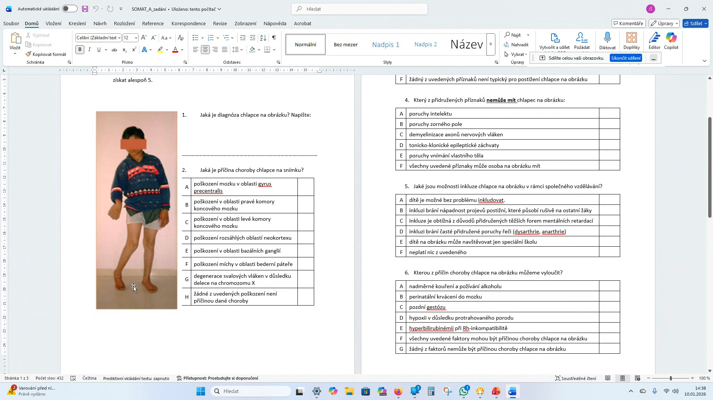
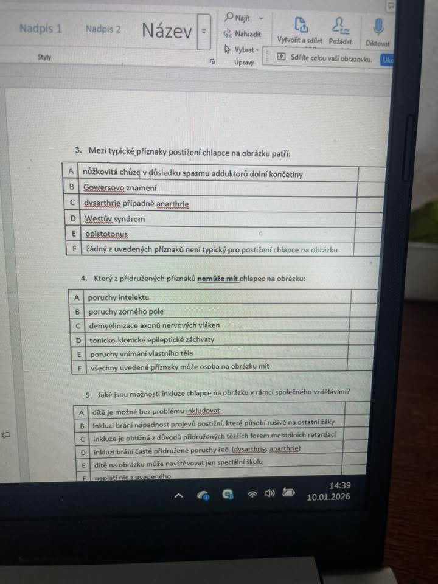
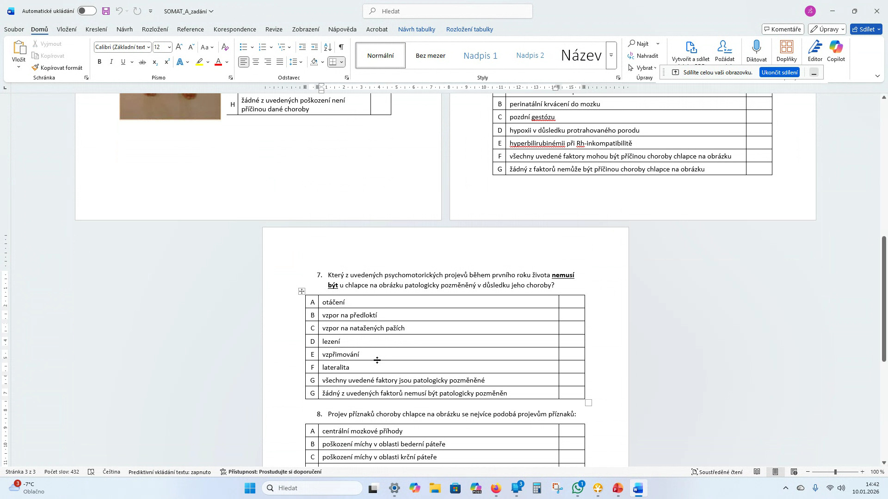
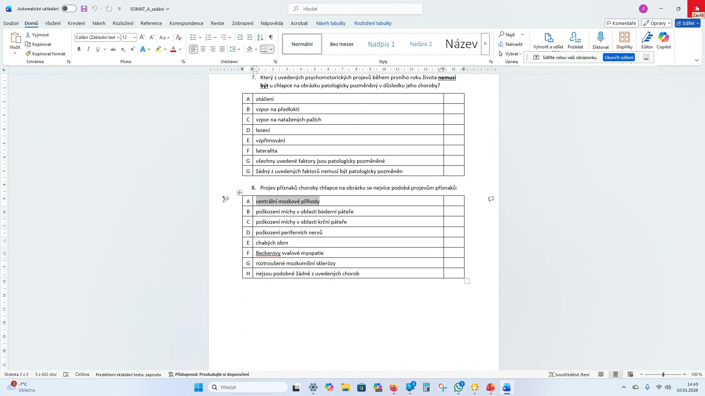

# KOMPLETNÍ PŘEPIS ZADÁNÍ A VÝSLEDKY TESTU ZE SOMATOPEDIE ( získat alespoň 5 bodů ) - POZOR SEKCE 3 NA OBRÁZCÍCH  CHYBÍ!

## I. Zadání z obrázků (Původní text)

1. **Jaká je diagnóza chlapce na obrázku? Napište:**

   _______________________________________________________

2. **Jaká je příčina choroby chlapce na snímku?**
   * A) poškození mozku v oblasti gyrus praecentralis
   * B) poškození v oblasti pravé komory koncového mozku
   * C) poškození v oblasti levé komory koncového mozku
   * D) poškození rozsáhlých oblastí neokortexu
   * E) poškození v oblasti bazálních ganglií
   * F) poškození míchy v oblasti bederní páteře
   * G) degenerace svalových vláken v důsledku delece na chromozomu X
   * H) žádné z uvedených poškození není příčinou dané choroby

### 3. Mezi typické příznaky postižení chlapce na obrázku patří:

| | Možnost |
| :--- | :--- |
| **A** | nůžkovitá chůze v důsledku spasmu adduktorů dolní končetiny |
| **B** | Gowersovo znamení |
| **C** | dysarthrie případně anarthrie |
| **D** | Westův syndrom |
| **E** | opistotonus |
| **F** | žádný z uvedených příznaků není typický pro postižení chlapce na obrázku |

4. **Který z přidružených příznaků nemůže mít chlapec na obrázku:**
   * A) poruchy intelektu
   * B) poruchy zorného pole
   * C) demyelinizace axonů nervových vláken
   * D) tonicko-klonické epileptické záchvaty
   * E) poruchy vnímání vlastního těla
   * F) všechny uvedené příznaky může osoba na obrázku mít

5. **Jaké jsou možnosti inkluze chlapce na obrázku v rámci společného vzdělávání?**
   * A) dítě je možné bez problému inkludovat
   * B) inkluzi brání nápadnost projevů postižení, které působí rušivě na ostatní žáky
   * C) inkluze je obtížná z důvodů přidružených těžších forem mentálních retardací
   * D) inkluzi brání časté přidružené poruchy řeči (dysarthrie, anarthrie)
   * E) dítě na obrázku může navštěvovat jen speciální školu
   * F) neplatí nic z uvedeného

6. **Kterou z příčin choroby chlapce na obrázku můžeme vyloučit?**
   * A) nadměrné kouření a požívání alkoholu
   * B) perinatální krvácení do mozku
   * C) pozdní gestózu
   * D) hypoxii v důsledku protahovaného porodu
   * E) hyperbilirubinémii při Rh-inkompatibilitě
   * F) všechny uvedené faktory mohou být příčinou choroby chlapce na obrázku
   * G) žádný z faktorů nemůže být příčinou choroby chlapce na obrázku

7. **Který z uvedených psychomotorických projevů během prvního roku života nemusí být u chlapce na obrázku patologicky pozměněný v důsledku jeho choroby?**
   * A) otáčení, B) vzpor na předloktí, C) vzpor na natažených pažích, D) lezení, E) vzpřimování, F) lateralita...

8. **Projev příznaků choroby chlapce na obrázku se nejvíce podobá projevům příznaků:**
   * A) centrální mozkové příhody
   * B) poškození míchy v oblasti bederní páteře
   * C) poškození míchy v oblasti krční páteře
   * D) poškození periferních nervů
   * E) chabých obrn
   * F) Beckerovy svalové myopatie
   * G) roztroušené mozkomíšní sklerózy

---

## II. Výsledek a řešení (Shrnutí)

1/ Jaká je diagnóza chlapce na obrázku? Napište: **Pravostranná hemiparéza**

2/ Jaká je příčina choroby chlapce na snímku?
**C** – poškození v oblasti levé komory koncového mozku

3/ Mezi typické příznaky postižení chlapce na obrázku patří:
**F** – žádný z uvedených příznaků není typický pro postižení chlapce na obrázku

4/ Který z přidružených příznaků **<u>nemůže mít</u>** chlapec na obrázku:
**C** – demyelinizace axonů nervových vláken

5/ Jaké jsou možnosti inkluze chlapce na obrázku v rámci společného vzdělávání?
**A** – dítě je možné bez problémů inkludovat

6/ Kterou z příčin choroby chlapce na obrázku můžeme vyloučit?
**E** – hyperbilirubinémii při Rh-inkompatibilitě

7/ Který z uvedených psychomotorických projevů během prvního roku života **<u>nemusí být</u>** u chlapce na obrázku patologicky pozměněný v důsledku jeho choroby?
**F** – lateralita

8/ Projev příznaků choroby chlapce na obrázku se nejvíce podobá projevům příznaků:
**A** – centrální mozkové příhody

**Klíčový poznatek:** Jelikož obrázek ukazuje postižení pravé strany těla, příčina musí být v **levé hemisféře** mozku kvůli křížení nervových drah.
